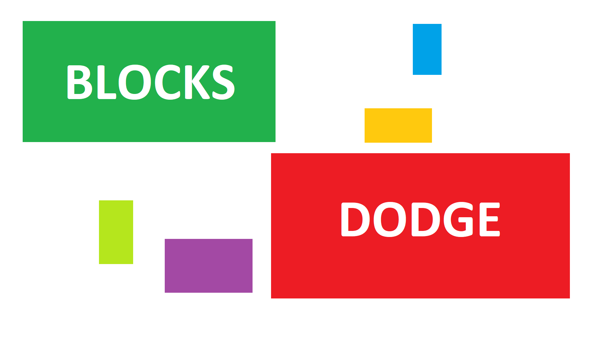

# Blocks-Dodge
#### Avoid the obstacles and try to score as many points as possible.
A game I made when I was 12 years old. Made in python with pygame. This is the original code, I just translated it to english. And also currently only playable on a 4k screen, because I wanted it to be fullscreen at the time and didn't know how to adapt it to other screen sizes...

The game supports single and multiplayer.

## Instructions
- Avoid the obstacles
- Use W to move up. (Green Player)
- Use S to move down. (Green Player)
- Use Arrow Up to move up. (Blue Player)
- Use Arrow Down to move down. (Blue Player)
- Use Esc to open the main menu.
- Have fun!
